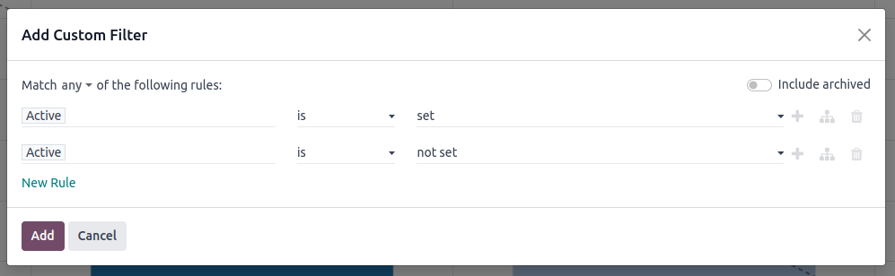

=================
Pipeline Analysis
=================

The *CRM* app manages the sales pipeline as leads/opportunities move from stage to stage,
origination to sale (Won) or archival (Lost).

After organizing the pipeline, use the search options and reports in the *Pipeline Analysis* page
to gain insight into the effectiveness of the pipeline and its users.

To open the *Pipeline Analysis*, go to :menuselection:`CRM app --> Reporting --> Pipeline`.

.. image:: win_loss/reporting-tab-and-pipeline-view.png
   :align: center
   :alt: Open the CRM app and click on the Reporting tab along the top, then click Pipeline.

.. _win_loss/pipeline:

Navigating the analysis page
============================

Upon opening the :guilabel:`Pipeline Analysis` page, a graph of the opportunities (active leads)
from the past year automatically populates. The bars represent the number of opportunities in each
stage of the sales pipeline, color-coded to show the month the opportunity reached that stage.

The interactive elements of the :guilabel:`Pipeline Analysis` page manipulate the graph to report
different metrics in several views. From left-to-right, top-to-bottom, the elements include:

- :guilabel:`Actions`: The :guilabel:`gear-shaped icon` next to :guilabel:`Pipeline Analysis` opens
  a menu with options for inserting/linking the graph in a *Knowledge* article, adding the graph to
  :guilabel:`My dashboard` in the *Dashboards* app, or linking the graph in a spreadsheet in the
  *Documents* app. (See :ref:`Saving and sharing reports <win_loss/save_reports>` for more
  information)
- :guilabel:`Search bar`: Shows the filters and groupings currently being applied to the graph. To
  add new filters/groups, type them into the search bar or click the :guilabel:`down arrow` at the
  end of the bar to open a menu of options. (See :ref:`Search Options <win_loss/search>` for more
  information)
- :guilabel:`Graph`: Switches the analysis to Graph View. By default, this is selected.  (See
  :ref:`View Options <win_loss/view>` for more information)
- :guilabel:`Pivot`: Switches the analysis to Pivot View, which displays the results in a table.
- :guilabel:`Cohort`: Switches the analysis to Cohort View, which displays the results by their
  :guilabel:`Created on` week and :guilabel:`Closed Date` week.
- :guilabel:`List`: Switches the analysis to List View, which displays the results in a single list.
- :guilabel:`Measures`: Opens a drop-down menu of different measurements for the graph. By default,
  the graph uses :guilabel:`Count`, which is the total number of records matching the search
  criteria.  (See :ref:`Measurement Options <win_loss/measure>` for more information)
- :guilabel:`Insert in Spreadsheet`: Opens a pop-up menu with options for adding the graph to a
  spreadsheet in the *Documents* app or a dashboard in the *Dashboards* app.
- :guilabel:`Bar Chart`: Switches the graph to a bar chart. By default, this is selected.
- :guilabel:`Line Chart`: Switches the graph to a line chart.
- :guilabel:`Pie Chart`: Switches the graph to a pie chart.
- :guilabel:`Stacked`: When selected, the results each stage of the graph are stacked on top of each
  other. When not selected, the results in each stage are shown as individual bars. By default,
  this is selected.
- :guilabel:`Descending`: Re-orders the stages in the graph in descending order from left-to-right.
  Click the icon a second time to deselect it. Depending on the search criteria, this option may not
  be available.
- :guilabel:`Ascending`: Re-orders the stages in the graph in ascending order from left-to-right.
  Click the icon a second time to deselect it. Depending on the search criteria, this option may not
  be available.

.. _win_loss/search:

Search options
--------------

The :guilabel:`Pipeline Analysis` can be customized with various filters and group by options.

To add new search criteria, type it into the search bar or click the :guilabel:`down arrow` next to
the search bar to open a menu of all options. See the sections below for more information on what
each option does.

.. tabs::

   .. tab:: Filters

      The :guilabel:`Filters` section allows users to add pre-made and custom filters to the search
      criteria. Multiple filters can be added to a single search as "and, "or", or "and/or"
      statements.

      - :guilabel:`My Pipeline`: Only show leads/opportunities assigned to the current user.
      - :guilabel:`Opportunities`: Only show leads that have been qualified as opportunities.
      - :guilabel:`Leads`: Only show leads that have yet to be qualified as opportunities.
      - :guilabel:`Active`: Only show active leads.
      - :guilabel:`Inactive`: Only show inactive leads.
      - :guilabel:`Won`: Only show leads/opportunities that have been marked Won.
      - :guilabel:`Lost`: Only show leads/opportunities that have been marked Lost.
      - :guilabel:`Created On`: Only show leads/opportunities that were created during a specific
        period of time. By default, this is the past year, but it can be adjusted as needed or
        removed entirely.
      - :guilabel:`Expected Closing`: Only show leads/opportunities that are expected to close
        (marked Won) during a specific period of time.
      - :guilabel:`Date Closed`: Only show leads/opportunities that were closed (marked Won) during
        a specific period of time.
      - :guilabel:`Archived`: Only show leads/opportunities that have been archived.
      - :guilabel:`Add Custom Filter`: Allows the user to create a custom filter with numerous
        options. (See :ref:`Adding Custom Filters and Groups <win_loss/custom_filters>` for more
        information)

   .. tab:: Group By

      The :guilabel:`Group By` section allows users to add pre-made and custom groupings to the
      search results. Multiple groupings can be added to split results into more manageable chunks.

      .. important::
         The order that groupings are added affects how the final results are displayed. Try
         selecting the same combinations in a different order to see what works best for each use
         case.

      - :guilabel:`Salesperson`: Groups the results by the Salesperson a lead/opportunity is
        assigned to.
      - :guilabel:`Sales Team`: Groups the results by the Sales Team a lead/opportunity is assigned
        to.
      - :guilabel:`City`: Groups the results by the city a lead/opportunity originated from.
      - :guilabel:`Country`: Groups the results by the country a lead/opportunity originated from.
      - :guilabel:`Company`: Groups the results by the Company a lead/opportunity belongs to (if
        multiple companies are activated in the database).
      - :guilabel:`Stage`: Groups the results by the stages of the sales pipeline.
      - :guilabel:`Campaign`: Groups the results by the marketing campaign a lead/opportunity
        originated from.
      - :guilabel:`Medium`: Groups the results by the medium (Email, Google Adwords, Website, etc.)
        a lead/opportunity originated from.
      - :guilabel:`Source`: Groups the results by the source (Search engine, Lead Recall,
        Newsletter, etc.) a lead/opportunity originated from.
      - :guilabel:`Creation Date`: Groups the results by the date a lead/opportunity was added to
        the database.
      - :guilabel:`Conversion Date`: Groups the results by the date a lead was qualified/converted
        to an opportunity.
      - :guilabel:`Expected Closing`: Groups the results by the date a lead/opportunity is expected
        to close (marked Won).
      - :guilabel:`Closed Date`: Groups the results by the date a lead/opportunity was closed
        (marked Won).
      - :guilabel:`Lost Reason`: Groups the results by the reason selected when a lead/opportunity
        was marked Lost.
      - :guilabel:`Add Custom Group`: Allows the user to create a custom group with numerous
        options. (See :ref:`Adding Custom Filters and Groups <win_loss/custom_filters>` for more
        information)

   .. tab:: Comparison

      The :guilabel:`Comparison` section allows users to add comparisons to the same search criteria
      over another period of time.

      This option is only available if the search criteria include time-based filters such as
      :guilabel:`Created On`, :guilabel:`Expected Closing`, and/or :guilabel:`Date Closed`. While
      multiple time-based filters can be added at once, only one comparison can be selected at a
      time.

      - :guilabel:`Previous Period`: Adds a comparison to the same search criteria from the previous
        period.
      - :guilabel:`Previous Year`: Adds a comparison to the same search criteria from the previous
        year.

   .. tab:: Favorites

      The :guilabel:`Favorites` section allows users to save a search for later, so it does not need
      to be recreated every time.

      Multiple searches can be saved, shared with others, or even set as the default for whenever
      the :guilabel:`Pipeline Analysis` is opened.

      - :guilabel:`Save current search`: Save the current search criteria for later.

        - :guilabel:`Default filter`: When saving a search, check this box to make it the default
          search when opening the :guilabel:`Pipeline Analysis` page.
        - :guilabel:`Shared`: When saving a search, check this box to make it available to other
          users.

.. _win_loss/custom_filters:

Adding custom filters and groups
~~~~~~~~~~~~~~~~~~~~~~~~~~~~~~~~

In addition to the pre-made options in the search bar, the :guilabel:`Pipeline Analysis` can also
utilize custom filters and groups.

Custom filters are complex rules that further customize the search results, while custom groups
display the information in a more organized fashion.

**To add a custom filter:**

1. At the :guilabel:`Pipeline Analysis` page, click the :guilabel:`down arrow` next to the search
   bar.
2. In the pop-up menu, click :guilabel:`Add Custom Filter`.
3. The :guilabel:`Add Custom Filter` pop-up window will open with a default rule
   (:guilabel:`Country is in _____`) comprised of three (3) unique fields. These fields can be
   edited to make a custom rule, and multiple rules can be added to a single custom filter.
4. To edit a rule, start by clicking the first field (:guilabel:`Country`), and select an option
   from the drop-down menu. The first field determines the primary subject of the rule.

5. Next, click the second field and select an option from the drop-down menu. The second field
   determines the relationship of the first and third fields, and is usually an "is" or "is not"
   statement, but can be "greater than/less than" statements, whether the first field "contains"
   certain elements, and more.

6. Finally, click the third field and select an option from the drop-down menu. The third field
   determines the secondary subject of the rule.

7. With all three (3) fields selected, the rule is complete.

   - **To add more rules:** Click :guilabel:`New Rule` and repeat steps 4-7 as needed.
   - **To delete a rule:** Click the trashcan-shaped :guilabel:`Delete node` icon to the right of
     the rule.
   - **To duplicate an existing rule:** Click the :guilabel:`+` icon to the right of the rule.
   - **To create more complex rules:** Click the :guilabel:`Add branch` icon to the right of the
     rule. This adds another modifier below the rule for adding an "all of" or "any of" statement.

8. Once all rules have been added, click :guilabel:`Add` to add the custom filer to the search
   criteria.

To remove a custom filter, open the search bar menu and click on the custom filter again.

**To add a custom group:**

1. At the :guilabel:`Pipeline Analysis` page, click the :guilabel:`down arrow` next to the search
   bar.
2. In the pop-up menu, click :guilabel:`Add Custom Group`.
3. Scroll through the options in the drop-down menu and select one or more groups.

To remove a custom group, open the search bar menu and click on the custom group again.

.. _win_loss/measure:

Measurement options
-------------------

By default, the :guilabel:`Pipeline Analysis` measures the total :guilabel:`Count` of
leads/opportunities that match the search criteria, but can be changed to measure other items of
interest.

.. image:: win_loss/measure-button-menu.png
   :align: center
   :alt: The Measures button opens a menu with different measurement options for the analysis.

To change the selected measurement, click the :guilabel:`Measures` button on the top-left of the
page and select one of the following options from the drop-down menu:

- :guilabel:`Days to Assign`: Measures the number of days it took lead/opportunity to be assigned
  after creation.
- :guilabel:`Days to Close`: Measures the number of days it took a lead/opportunity to be closed
  (marked Won).
- :guilabel:`Days to Convert`: Measures the number of days it took a lead to be qualified/converted
  to an opportunity.
- :guilabel:`Exceeded Closing Days`: Measures the number of days by which a lead/opportunity
  exceeded its Expected Closing date.
- :guilabel:`Expected MRR`: Measures the Expected Recurring Revenue of a lead/opportunity.
- :guilabel:`Expected Revenue`: Measures the Expected Revenue of a lead/opportunity.
- :guilabel:`Prorated MRR`: Measures the Prorated Monthly Recurring Revenue of a lead/opportunity.
- :guilabel:`Prorated Recurring Revenues`: Measures the Prorated Recurring Revenues of a
  lead/opportunity.
- :guilabel:`Prorated Revenue`: Measures the Prorated Revenue of a lead/opportunity.
- :guilabel:`Recurring Revenues`: Measures the Recurring Revenue of a lead/opportunity.
- :guilabel:`Count`: Measures the total :guilabel:`Count` of leads/opportunities that match the
  search criteria. By default, this measurement is selected.

.. _win_loss/view:

View options
------------

After configuring filters, groupings, and measurements, the :guilabel:`Pipeline Analysis` can
display the data in a variety of ways. By default, the page uses the :guilabel:`Graph View`, but can
be changed to a :guilabel:`Pivot View` (table), :guilabel:`Cohort View`, or :guilabel:`List View`.

To change the pipeline to a different view, click one of the four (4) icons in the top-right of the
:guilabel:`Pipeline Analysis`.

.. image:: win_loss/pivot-and-list-views.png
   :align: center
   :alt: The same win/loss report displays different information when using Pivot View or List View.

.. tabs::

   .. tab:: Graph View

      The :guilabel:`Graph View` is the default selection for the :guilabel:`Pipeline Analysis`. It
      displays the analysis as either a Bar Chart, Line Chart, or Pie Chart.

      This view is useful for quickly visualizing and comparing simple relationships like the
      :guilabel:`Count` of leads in each stage or assigned to each :guilabel:`Salesperson`.

      By default, the graph measures the :guilabel:`Count` of leads/opportunities in each group, but
      this can be changed by clicking the :guilabel:`Measures` button and :ref:`selecting another
      option <win_loss/measure>` from the resulting drop-down menu.

      .. image:: win_loss/graph-view.png
         :align: center
         :alt: The Graph View displays the analysis as a Bar Chart, Line Chart, or Pie Chart.

      .. tip::
         When using a Bar Chart in this view, consider deselecting :guilabel:`Stacked` to make the
         breakdown of results more legible.

      In addition to being viewed here, the graph can be added to a dashboard or spreadsheet by
      clicking the :guilabel:`Insert in Spreadsheet` button and toggling between the
      :guilabel:`Spreadsheets` and :guilabel:`Dashboards` tabs in the resulting pop-up window.

   .. tab:: Pivot View

      The :guilabel:`Pivot View` displays the results of the analysis as a table.

      By default, the table groups the results by the stages of the sales pipeline, and measures
      :guilabel:`Expected Revenue` instead of :guilabel:`Count`.

      The :guilabel:`Stage` grouping cannot be removed, but the measurement can be changed by
      clicking the :guilabel:`Measures` button and selecting another option.

      The :guilabel:`Pivot View` is useful for seeing more detailed numbers than the
      :guilabel:`Graph View` can handle, or for adding the data to a spreadsheet where custom
      formulas can be set up like in an Excel file.

      .. image:: win_loss/pivot-view.png
         :align: center
         :alt: The Pivot View displays the analysis as a table.

      The three (3) icons at the top-left of the page perform the following functions:

      - :guilabel:`Flip Axis`: Flips the X and Y axis for the entire table.
      - :guilabel:`Expand All`: When additional groupings are selected using the :guilabel:`+`
        icons, this button opens those groupings under every row.
      - :guilabel:`Download xlsx`: Downloads the table as an Excel file.

      In addition to being viewed here, the table can be added to a dashboard or spreadsheet by
      clicking the :guilabel:`Insert in Spreadsheet` button and toggling between the
      :guilabel:`Spreadsheets` and :guilabel:`Dashboards` tabs in the resulting pop-up window.

   .. tab:: Cohort View

      The :guilabel:`Cohort View` displays the analysis as groups (cohorts) of days, weeks, months,
      or years.

      This view is useful specifically for comparing how long it has taken to close
      leads/opportunities by days/weeks/months/years.

      By default, :guilabel:`Week` is selected as the period of time, but it can be changed by
      clicking the :guilabel:`Week` button in the top-left of the page and selecting another option.

      .. image:: win_loss/cohort-view.png
         :align: center
         :alt: The Cohort View displays the analysis as individual weeks of the year.

      From left-to-right, top-to-bottom, the columns in the chart represent the following:

      - :guilabel:`Created On`: Rows in this column represents the weeks of the year in which
        records matching the search criteria exist.

        - When set to :guilabel:`Week`, a row with the label :guilabel:`W52 2023` means the results
          occurred in :guilabel:`Week 52 of the Year 2023`.
      - :guilabel:`Measures`: The second column in the chart is the measurement of the results. By
        default, it is set to :guilabel:`Count`, but can be changed by clicking the
        :guilabel:`Measures` button and selecting an option from the drop-down menu.
      - :guilabel:`Closed Date - By Day/Week/Month/Year`: This column looks at what percentage of
        the measured results were closed in subsequent days/weeks/months/years. By default,
        :guilabel:`Week` is selected as the period of time.
      - :guilabel:`Average`: This row provides the average of all other rows in the column.

      In addition to being viewed here, clicking the gear-shaped :guilabel:`Actions` icon opens a
      drop-down menu with options to insert/link to the :guilabel:`Cohort View` in the *Knowledge*
      app, or add it to a dashboard or spreadsheet.

      The :guilabel:`Cohort View` can also be downloaded as an Excel file by clicking the
      :guilabel:`Download` icon in the top-left of the page.

   .. tab:: List View
      The List View displays a single list of all leads/opportunities matching the search criteria.
      This view is useful for reviewing and digging deeper on many records at once.

      Clicking on a lead/opportunity opens the record for closer review.

      .. image:: win_loss/list-view.png
         :align: center
         :alt: The List View displays a single list of all records matching the search criteria.

      Additional details for each record such as :guilabel:`Country`, :guilabel:`Medium`, and more
      can be added to the list by clicking the :guilabel:`Filters` icon in the top-right of the
      list.

      .. image:: win_loss/list-view-columns.png
         :align: center
         :alt: More details can be added to the list by clicking the Filters icon in the top-right.

      Clicking the gear-shaped :guilabel:`Actions` icon opens a drop-down menu with options for the
      following:

      - :guilabel:`Import records`: Opens a page for uploading a spreadsheet of data, as well as a
        template spreadsheet for easily formatting that data.
      - :guilabel:`Export All`: Downloads the list as an xlsx file for Excel.
      - :guilabel:`Knowledge`: Inserts a view of or link to the list in an article in the
        *Knowledge* app.
      - :guilabel:`Dashboard`: Adds the list to :guilabel:`My Dashboard` in the *Dashboards* app.
      - :guilabel:`Spreadsheet`: Links to or inserts the list in a spreadsheet in the *Documents*
        app.

      .. note::
         At the List View, clicking :guilabel:`New` closes the list and opens the *New Quotation*
         page. Clicking :guilabel:`Generate Leads` opens a pop-up for lead generation. Neither
         feature is intended to manipulate the List View.

.. _win_loss/reports:

Creating reports
================

After understanding how to :ref:`navigate the analysis page <win_loss/pipeline>`, the
:guilabel:`Pipeline Analysis` can be used to create and share different reports. Between the
pre-made options and custom filter/groupings, almost any combination is possible.

Once created, reports can be :ref:`saved to favorites, shared with other users, and added to
knowledge articles, dashboards, and spreadsheets <win_loss/save_reports>`.

A few common reports that can be created using the :guilabel:`Pipeline Analysis` are detailed below.

.. _win_loss/win_loss:

Win/Loss reports
----------------

Win/Loss is a metric of the leads/opportunities marked Won or Lost over a period of time. By
calculating "opportunities won" over "opportunities lost," teams can identify what methods and/or
individuals are effectively converting leads into sales.

A win/loss report filters **the leads/opportunities from the past year, whether won or lost, and
groups the results by their stage in the pipeline**. Creating this report requires a custom filter
and grouping the results by :guilabel:`Stage`.

.. image:: win_loss/search-criteria-for-basic-win-loss.png
   :align: center
   :alt: The search criteria for win/loss reports is Created On, Stage, and Active is in true false.

Follow the steps below to create a win/loss report:

1. Navigate to :menuselection:`CRM app --> Reporting --> Pipeline`.
2. At the :guilabel:`Pipeline Analysis` page, click on the :guilabel:`down arrow` next to the search
   bar to open a menu of filters and groupings.

   .. image:: win_loss/filters-for-basic-win-loss-report.png
      :align: center
      :alt: The Search menu containing the filters for a basic win/loss report.

3. In drop-down menu that appears, under the :guilabel:`Group By` heading, click :guilabel:`Stage`.
4. Under the :guilabel:`Filters` heading, click :guilabel:`Add Custom Filter` to open another pop-up
   menu.
5. In the :guilabel:`Add Custom Filter` pop-up menu, click on the first field in the
   :guilabel:`Match any of the following rules:` section. By default, this field displays
   :guilabel:`Country`.
6. Clicking that first field reveals a sub-menu with numerous options to choose from. From this
   sub-menu, locate and select the :guilabel:`Active` option. Doing so, auto-populates the remaining
   fields. The first field reads: :guilabel:`Active`. The second field reads: :guilabel:`is`. And
   lastly, the third field reads: :guilabel:`set`. In total, the rule reads: :guilabel:`Active is
   set`.
7. Click :guilabel:`New Rule`, change the first field to :guilabel:`Active`, and the last field to
   :guilabel:`not set`. In total, the rule reads :guilabel:`Active is not set`.
8. Click :guilabel:`Add`.

The report now displays the total :guilabel:`Count` of leads, whether won or lost, grouped by their
stage in the CRM pipeline. Hover over a section of the report to see the number of leads in that
stage.

Customizing win/loss reports
~~~~~~~~~~~~~~~~~~~~~~~~~~~~

After :ref:`creating a win/loss report <win_loss/win_loss>`, consider using the options below to
customize the report for different needs.

.. example::
   A sales manager might group wins and losses by salesperson, or sales team, to see who has the
   best conversion rate. Or, a marketing team might group by sources, or medium, to determine where
   their advertising has been most successful.

.. tabs::

   .. tab:: Filters and groups

      To add more filters and groups, click the :guilabel:`down arrow` next to the search bar and
      select one or more options from the drop-down menu.

      Some useful options include:

      - **Created On**: Adjusting this filter to a different period of time such as the last 30 days
        or the last quarter can provide more timely results.
      - **Add Custom Filter**: Clicking :guilabel:`Add Custom Filter` and scrolling through the
        numerous options in the drop-down opens up additional search criteria like :guilabel:`Last
        Stage Update` or :guilabel:`Lost Reason`.
      - **Multiple Groupings**: Adding multiple :guilabel:`Group By` selections can split results
        into more relevant and manageable chunks.

        - Adding :guilabel:`Salesperson` or :guilabel:`Sales Team` breaks up the total count of
          leads in each :guilabel:`Stage` by who they were assigned to.
        - Adding :guilabel:`Medium` or :guilabel:`Source` can reveal what marketing avenues generate
          more sales.
      - **Add Custom Group > Active**: Clicking :menuselection:`Add Custom Group --> Active`
        separates the results into Won (:guilabel:`true`) or Lost (:guilabel:`false`). This shows
        at what stage leads are being marked won or lost.

      .. image:: win_loss/search-panel-filters-and-group-by-options.png
         :align: center
         :alt: The Search menu open and the Won and Lost filters highlighted.

   .. tab:: Pivot View

      By default, :guilabel:`Pivot View` groups win/loss reports by :guilabel:`Stage` and measures
      :guilabel:`Expected Revenue` instead of the :guilabel:`Count` of leads.

      To flesh out the table, click the :guilabel:`down arrow` next to the search bar, and in the
      pop-up menu, replace the :guilabel:`Stage` grouping with something like
      :guilabel:`Salesperson` or :guilabel:`Medium`.

      Then click the :guilabel:`Measures` button and add the :guilabel:`Count` of leads back into
      the report.

      Other useful measures for :guilabel:`Pivot View` include :guilabel:`Days to Assign` and
      :guilabel:`Days to Close`.

      .. image:: win_loss/win-loss-pivot-view.png
         :align: center
         :alt: A win/loss report in Pivot View displays the data in table form.

      .. important::
         By default, the :guilabel:`Insert In Spreadsheet` button may be greyed out due to the
         report containing :guilabel:`duplicate group bys`.

         To fix this, replace the :guilabel:`Stage` grouping in the search bar with another option.

   .. tab:: List View

      In :guilabel:`List View`, a win/loss report displays all leads on a single page.

      To add more columns to the list, click the :guilabel:`Filters` icon in the top-right of the
      page, and select options from the resulting drop-down menu. Some useful filters include:

      - **Campaign**: Shows the marketing campaign that originated each lead.
      - **Medium**: Shows the marketing medium (Banner, Direct, Email, Google Adwords, Phone,
        Website, etc.) that originated each lead.
      - **Source**: Shows the source of each lead (Newsletter, Lead Recall, Search Engine, etc.).

      To better organize the list, click the :guilabel:`down arrow` next to the search bar, and
      add more relevant groupings or re-organize the existing ones.

      To re-order the nesting, remove all :guilabel:`Group By` options and re-add them in the
      desired order.

      .. image:: win_loss/win-loss-list-view.png
         :align: center
         :alt: A win/loss report in List View displays all leads in an easy-to-read list.

.. _win_loss/save_reports:

Saving and sharing reports
==========================

After :ref:`creating a report <win_loss/reports>`, the search criteria can be saved, so the report
does not need to be created again in the future. Saved searches automatically update their results
every time the report is opened.

Additionally, reports can be shared with others or added to spreadsheets/dashboards for greater
customization and even easier access.

.. tabs::

   .. tab:: Save to Favorites

      To save a report for later:

      At the :guilabel:`Pipeline Analysis` page, click the :guilabel:`down arrow` next to the search
      bar, and under the :guilabel:`Favorites` heading, click :guilabel:`Save current search`.

      In the drop-down menu that appears, enter a name for the report. By default, the report is
      named "Pipeline".

      - Optional: Checking the :guilabel:`Default filter` box sets this report as the default
        analysis when opening the :guilabel:`Pipeline Analysis` page.
      - Optional: Checking the :guilabel:`Shared` box makes this report available to other
        users.

      Finally, click :guilabel:`Save`. The report is now saved under the :guilabel:`Favorites`
      heading.

      .. image:: win_loss/save-to-favorites.png
         :align: center
         :alt: Under the Favorites heading, click Save current search and save the report for later.

   .. tab:: Add to a Spreadsheet

      Inserting a report into a spreadsheet not only saves a copy of the report, it allows the
      adding of charts and formulas similar to an Excel file.

      To add a report in to a spreadsheet:

      - **If in Graph or Pivot View**: Click either the :guilabel:`Insert in spreadsheet` button,
        and in the pop-up menu that appears, click :guilabel:`Confirm`.
      - **If in Cohort or List View**: Click the gear-shaped :guilabel:`Actions` icon, hover over
        :guilabel:`Spreadsheet`, and click either :guilabel:`Insert/Link in spreadsheet`.

        .. image:: win_loss/pivot-view-in-spreadsheet.png
           :align: center
           :alt: Pivot View reports especially benefit from being inserted in spreadsheets.

      .. tip::
         After modifying a spreadsheet and adding additional formulas, consider then adding the
         entire spreadsheet to a dashboard by clicking :menuselection:`File --> Add to dashboard`.

         In the resulting pop-up menu, name the spreadsheet and select a :guilabel:`Dashboard
         Section` to house the report. Once complete, click :guilabel:`Create`.

         Using this method, the spreadsheet can be added to a public dashboard instead of only
         :guilabel:`My Dashboard`.

   .. tab:: Add to a Dashboard

      Adding a report to a dashboard saves it for later and makes it easy to view alongside the rest
      of :guilabel:`My Dashboard`.

      To add a report to :guilabel:`My dashboard`:

      At the :guilabel:`Pipeline Analysis` page, click the gear-shaped :guilabel:`Actions` icon, and
      in the resulting drop-down menu, hover over :guilabel:`Dashboard`.

      Under the :guilabel:`Add to my dashboard` heading, enter a name for the report (by default, it
      is named "Pipeline") and click :guilabel:`Add`.

      To see the saved report, return to the main apps page, and navigate to
      :menuselection:`Dashboards app --> My Dashboard`.

      .. image:: win_loss/add-to-dashboard.png
         :align: center
         :alt: To access the saved report, open the Dashboard app and click My Dashboard.

.. seealso::
   - :doc:`../acquire_leads/convert`
   - :doc:`../acquire_leads/send_quotes`
   - :doc:`../pipeline/lost_opportunities`
